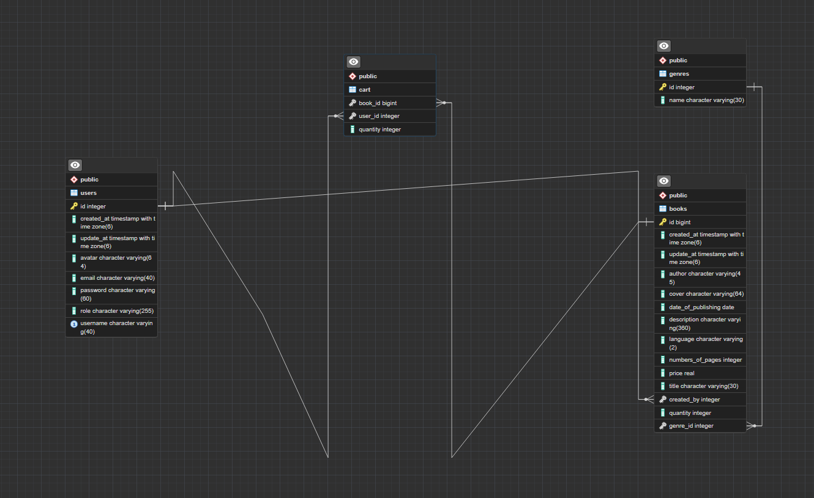

# Bookstore

## Overview
This project is Bookstore created with Java, Spring Boot, Spring Security, Spring JPA, HTML, CSS, JavaScript.

## Home Page


## Features
* The site contains a login and registration page for authorization.
* A home page to see all books with pagination.
* An ability to find a book by title. 
* The page to see a book information detailed.
* The page for viewing all books created by a specific user. This page also gives you the ability to update or delete the books of the user who created the books.
* The profile page update\see an information about a user.
* A book cart, books can be added to the cart.
* If you order a book online, you will receive an email to the Gmail you specified when creating your account.

## Getting Started 

### Database 

Before starting the project, you need to create a database with the tables shown in the screenshot. Or you can just create a database and then set a spring.jpa.hibernate.ddl-auto=update property in [properties](src/main/resources/application.properties) file



After that you need to set a password, login and ulr of your database.

### Email Service 

This programm uses smtp server gmail. 

In [properties](src/main/resources/application.properties) file you need to specify a username and a password(password of application) of email.

### Installation

1. Clone the repository to your local machine:

```bash
git clone https://github.com/HheZi/Bookstore
```

2. Navigate to the project directory:

```bash
cd Bookstore
```

3. Use docker compose if it is installed on your machine:

```bash
docker compose up
```

Or use gradle:

```bash
./gradlew bootRun
```

## Contributing

Contributions are welcome! If you have suggestions for improvements or new features, feel free to submit a pull request or open an issue.

1. Fork the repository.
2. Create your feature branch (git checkout -b feature/AmazingFeature).
3. Commit your changes (git commit -m 'Add some AmazingFeature').
4. Push to the branch (git push origin feature/AmazingFeature).
5. Open a pull request.